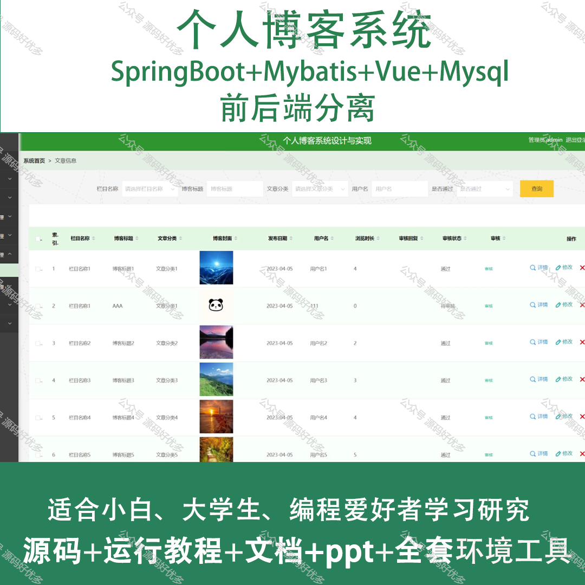
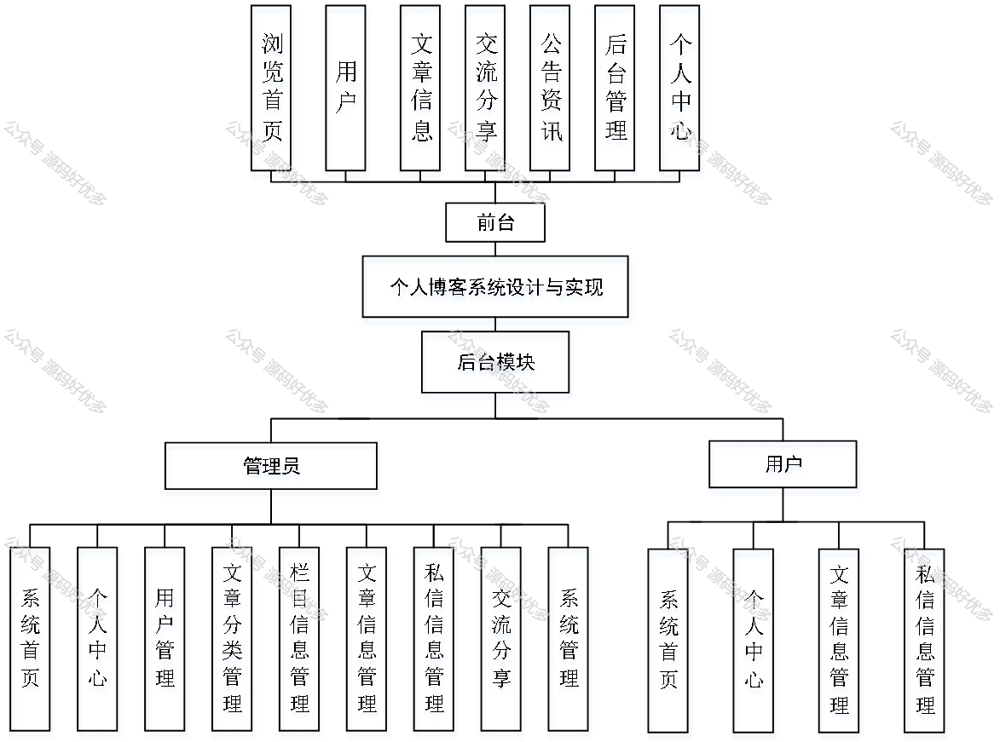
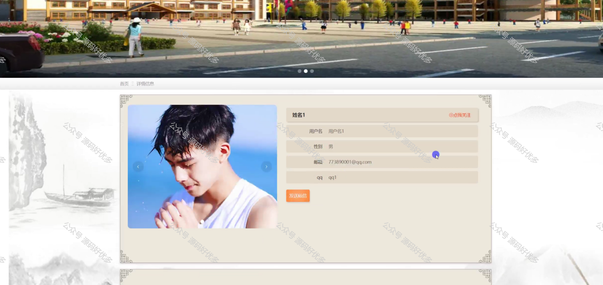
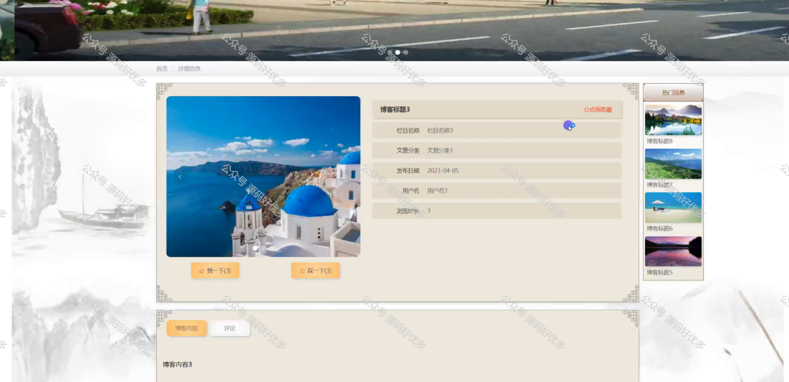
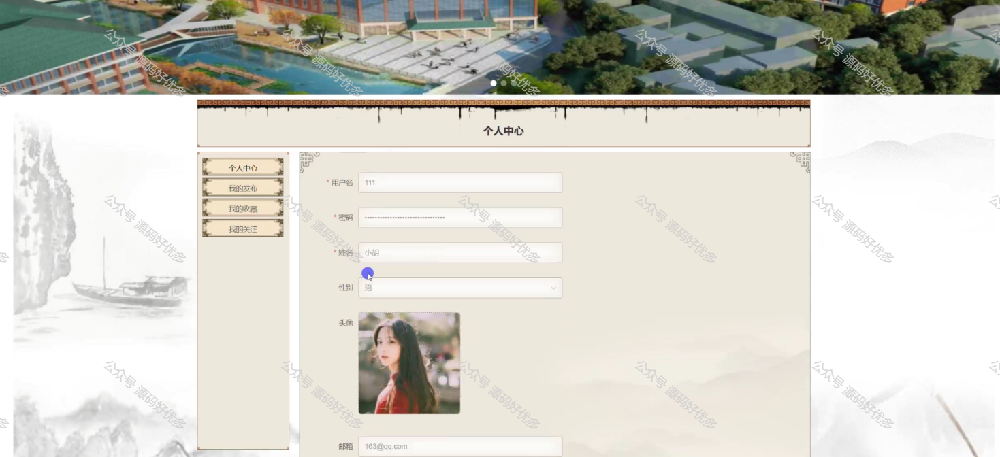
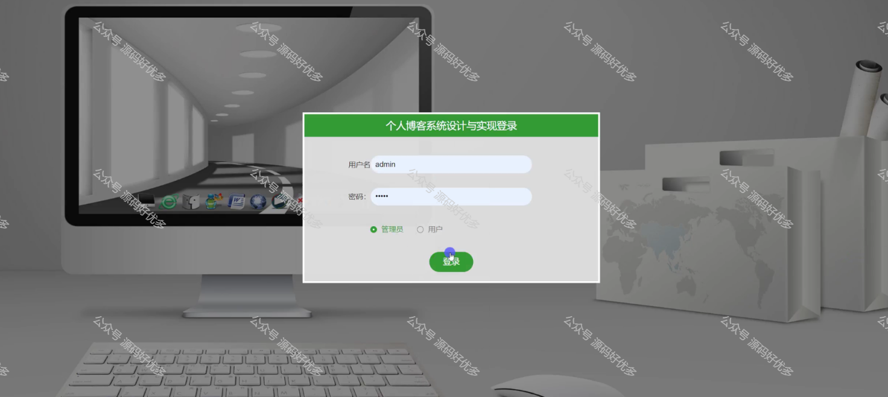
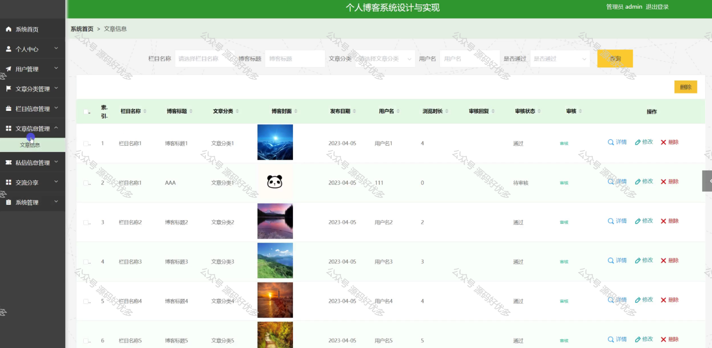
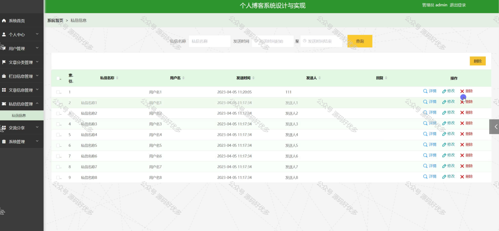
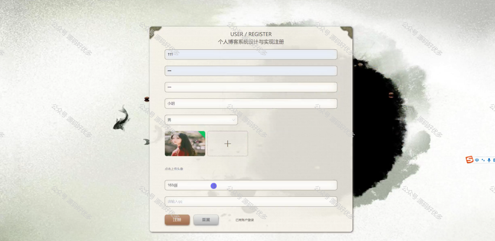
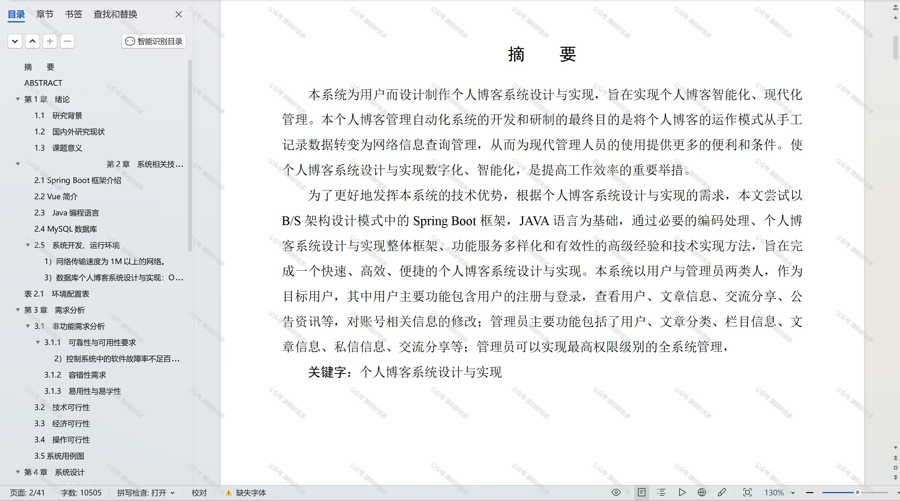

 
## 查看主页获取源码

### 一、作品包含

源码+数据库+设计文档万字+PPT+全套环境和工具资源+部署教程

### 二、项目技术

前端技术：Html、Css、Js、Vue、Element-ui

数据库：MySQL

后端技术：Java、Spring Boot、MyBatis

  

### 三、运行环境

开发工具：IDEA/eclipse

数据库：MySQL5.7

数据库管理工具：Navicat10以上版本

环境配置软件： JDK1.8+Maven3.6.3

前端Nodejs：14

### 四、项目介绍
项目编号：springbootA178

个人博客系统论文的背景是随着互联网的普及和社交媒体的发展，个人博客作为一种表达自我、分享知识、记录生活的方式，逐渐成为越来越多人的选择。然而，传统的博客平台往往缺乏个性化定制和用户交互功能，难以满足用户的多样化需求。因此，本文旨在研究和设计一个具有个性化界面、丰富交互功能和良好用户体验的个人博客系统。通过该系统，用户可以轻松地创建和管理自己的博客，同时与其他用户进行互动和交流，提高博客的吸引力和影响力。

前台用户功能：浏览首页、用户、文章信息、交流分享、公告资讯、后台管理和个人中心。

后台分为管理员和用户
管理员的功能：系统首页、个人中心、用户管理、文章分类管理、栏目信息管理、文章信息管理、私信信息管理、交流分享、系统管理。
用户的功能：系统首页、个人中心、文章信息管理、私信信息管理。

### 五、运行截图

  
